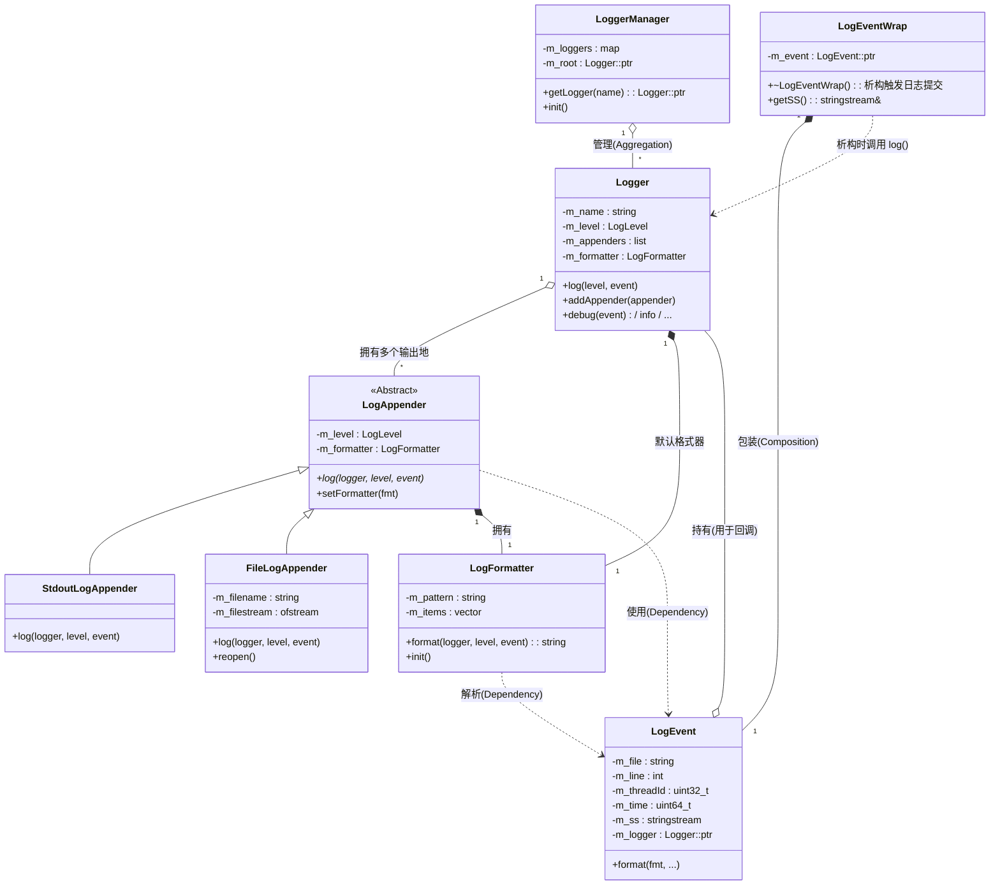
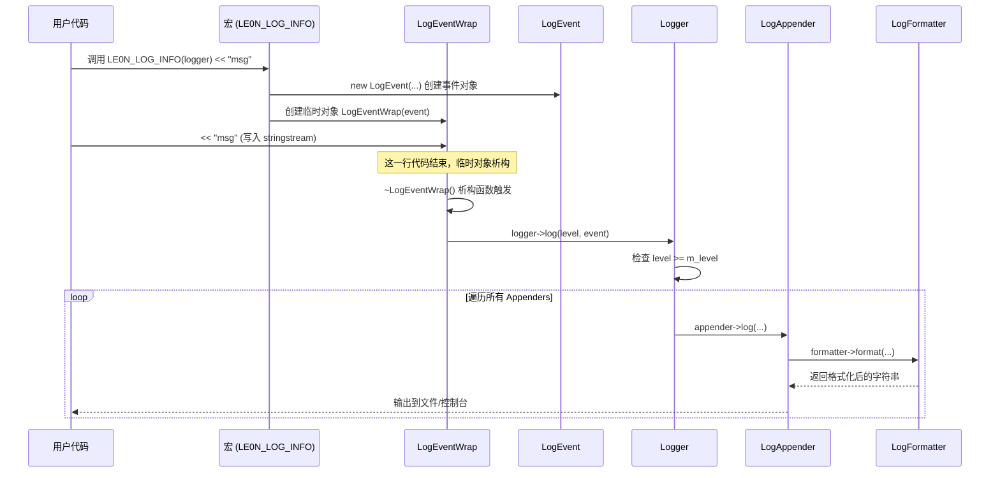

# C++ 高性能日志系统源码分析指南

本文档旨在帮助开发者（特别是 C++ 初学者）快速理解本项目的日志系统架构、设计意图及核心代码实现。

## 1. 项目概览

这是一个轻量级、可扩展的 C++ 日志库，模仿了 Log4j 的设计思想。
*   **核心功能**：支持多级别日志控制、流式日志输入、自定义日志格式、多种输出地（控制台、文件）。
*   **技术栈**：C++11 标准（大量使用智能指针、RAII 机制）。

## 2. 快速开始 (How to Build)

本项目使用 CMake 构建。

### 编译步骤
```bash
# 1. 在项目根目录下创建一个 build 目录
mkdir build && cd build

# 2. 生成 Makefile
cmake ..

# 3. 编译
make

# 4. 运行测试程序
../bin/le0n_test
```

### 简单使用示例

以下代码展示了如何创建一个日志器，并同时配置控制台输出和文件输出。

```cpp
// 引入头文件
#include "../le0n/log.h"
#include <iostream>

int main(int argc, char** argv) {
    // 1. 创建日志器 (Logger)
    le0n::Logger::ptr logger(new le0n::Logger);
    
    // 2. 添加控制台输出 (StdoutLogAppender)
    // 默认格式，输出到标准输出
    logger->addAppender(le0n::LogAppender::ptr(new le0n::StdoutLogAppender));

    // 3. 添加文件输出 (FileLogAppender)
    le0n::FileLogAppender::ptr file_appender(new le0n::FileLogAppender("./log.txt"));
    
    // 4. 自定义日志格式 (LogFormatter)
    // 格式含义：时间 线程ID 线程名 协程ID [级别] [日志名称] 文件名:行号 消息 换行
    le0n::LogFormatter::ptr fmt(new le0n::LogFormatter("%d{%Y-%m-%d %H:%M:%S}%T%t%T%N%T%F%T[%p]%T[%c]%T%f:%l%T%m%n"));
    file_appender->setFormatter(fmt);
    
    // 5. 设置文件输出的日志级别
    // 只有 ERROR 及以上级别的日志才会写入文件
    file_appender->setLevel(le0n::LogLevel::ERROR);

    logger->addAppender(file_appender);
    
    // 6. 开始打印日志
    std::cout << "hello le0n log" << std::endl; // 标准 cout 测试
    
    // 使用流式宏 (Stream Macro)
    LE0N_LOG_INFO(logger) << "test macro";       // 输出到控制台
    LE0N_LOG_ERROR(logger) << "test macro error"; // 输出到控制台 和 文件

    // 使用格式化宏 (Format Macro)
    LE0N_LOG_FMT_ERROR(logger, "test fmt error %s", "hello");

    // 7. 使用单例管理器获取日志器
    auto l = le0n::LoggerMgr::GetInstance()->getLogger("xx");
    LE0N_LOG_INFO(l) << "xxx";

    return 0;
}
```

---

## 3. 系统架构 (Architecture)

### 核心模块关系图 (Class Diagram)

整个系统由以下几个核心类组成，它们共同协作完成日志的收集、格式化和输出。



#### 类图解析
*   **组合关系 (Composition/Aggregation)**:
    *   `Logger "1" o-- "*" LogAppender`: 一个 Logger 对象内部维护了一个 Appender 列表。这意味着你可以给同一个 Logger 添加多个 Appender，实现“一次打印，多处输出”（例如同时写文件和打印屏幕）。
    *   `LogAppender "1" o-- "1" LogFormatter`: 每个 Appender 都有自己独立的 Formatter。这意味着你可以让控制台输出简单的格式，而文件日志输出包含详细时间戳的复杂格式。
*   **继承关系 (Inheritance)**:
    *   `LogAppender` 是一个抽象基类（定义了接口），`StdoutLogAppender`（控制台）和 `FileLogAppender`（文件）是它的具体实现类。这体现了多态性，方便未来扩展其他类型的输出地（如网络日志）。
*   **依赖关系 (Dependency)**:
    *   `Logger`, `LogAppender`, `LogFormatter` 都依赖于 `LogEvent`。`LogEvent` 是数据载体，在各个模块间传递。

#### **模块职责与关系深度解析**

整个日志系统可以划分为 **管理层、核心层、输出层** 和 **数据层**，它们通过巧妙的组合与依赖关系协同工作。

1. **管理层 (LoggerManager)**
   - **职责**：整个系统的入口，采用**单例模式**。它维护了一个 Map 容器来管理所有的 Logger 对象。
   - **关系**：LoggerManager 聚合（Aggregation）了多个 Logger。默认提供一个 root Logger，确保系统一启动即可用。
2. **核心层 (Logger)**
   - **职责**：日志系统的枢纽。它负责接收日志请求，进行级别判断（Filter），然后将合法的日志分发给内部持有的所有 LogAppender。
   - **关系**：Logger 内部维护了一个 LogAppender 列表（一对多关系），实现了一条日志既打印到控制台又写入文件的功能。
3. **数据与 RAII 层 (LogEventWrap & LogEvent)**
   - **LogEvent (数据包)**：这是一个纯粹的数据载体，封装了日志产生时的所有上下文（时间戳、线程ID、文件名、行号）以及用户写入的消息内容（m_ss stringstream）。
   - **LogEventWrap (触发器)**：**这是实现流式日志的关键类。**
     - 当用户使用宏 LE0N_LOG_INFO(logger) << "msg" 时，实际上是创建了一个临时的 LogEventWrap 对象。
     - **RAII 机制**：该对象内部持有一个 LogEvent。当这一行代码执行完毕，LogEventWrap 析构，其**析构函数**会自动调用 logger->log(event)，从而完成日志的自动提交。
4. **输出与格式化层 (Appender & Formatter)**
   - **LogAppender**：抽象基类，定义了“日志去哪儿”。子类 FileLogAppender 和 StdoutLogAppender 实现了具体的写入逻辑。
   - **LogFormatter**：负责“日志长什么样”。它将模式字符串（如 %d{%Y-%m-%d} %m%n）解析为一系列 FormatItem，最终将 LogEvent 中的数据拼装成字符串。每个 LogAppender 都有自己独立的 LogFormatter，这意味着控制台和文件可以有完全不同的日志格式。

### 核心对象关系图

1. LoggerManager (大管家) ：手里拿着一个账本 ( m_loggers )，管理着全系统所有的 Logger（比如 system logger, business logger, root logger）。
2. Logger (分队长) ：每个 Logger 负责一类日志，它手里拿着一份名单 ( m_appenders )，管理着多个输出目的地（比如同时输出到控制台和文件）。
3. LogAppender (执行者) ：真正的干活人，负责把日志写到具体的地方（屏幕、磁盘等）。


~~~mermaid
classDiagram
    LoggerManager "1" *-- "*" Logger : manages
    Logger "1" o-- "*" LogAppender : contains
    
    class LoggerManager {
        -map~string, Logger~ m_loggers
        +getLogger(name)
    }

    class Logger {
        -string m_name
        -list~LogAppender~ m_appenders
        -LogFormatter m_formatter
        +log(level, event)
        +addAppender(appender)
    }

    class LogAppender {
        <<Abstract>>
        -LogFormatter m_formatter
        +log(level, event)*
    }

    class StdoutLogAppender {
        +log()
    }

    class FileLogAppender {
        -string m_filename
        +log()
    }

    LogAppender <|-- StdoutLogAppender
    LogAppender <|-- FileLogAppender

~~~


## 4. 核心流程与关键机制

### 4.1 日志流转过程 (Sequence Diagram)

当你调用 `LE0N_LOG_INFO(logger) << "hello";` 时，系统内部发生了什么？



#### 流程解析
1.  **宏展开与对象创建**: 用户调用宏时，首先创建一个 `LogEvent` 对象（包含时间、行号等），然后将其包装进一个 `LogEventWrap` **临时对象**。
2.  **流式写入**: 用户紧接着使用的 `<< "msg"` 操作符，实际上是将数据写入了 `LogEventWrap` 持有的 `LogEvent` 内部的 `stringstream` 中。
3.  **RAII 自动提交**: 当这一行代码执行结束（遇到分号），`LogEventWrap` 临时对象生命周期结束，自动调用析构函数 `~LogEventWrap()`。
4.  **日志分发**: 在析构函数中，系统自动调用 `logger->log()` 方法，将携带了完整消息的 Event 提交给 Logger。
5.  **格式化与输出**: Logger 遍历其内部所有的 Appender，每个 Appender 调用自己的 Formatter 将 Event 转换成字符串，最后写入文件或控制台。

### 4.2 关键 C++ 特性解析

#### 1. RAII 与 临时对象析构 (The "Destructor Magic")
这是本项目最精彩的设计之一。
*   **问题**：如何实现类似 `std::cout` 的流式调用？
*   **方案**：
    1.  宏 `LE0N_LOG_INFO` 创建一个 `LogEventWrap` 的**临时对象**。
    2.  `LogEventWrap` 内部持有一个 `LogEvent` 指针。
    3.  用户使用的 `<<` 操作符实际上是向 `LogEvent` 内部的 `stringstream` 写入数据。
    4.  **关键点**：当这一行代码执行完毕（分号结束），临时对象 `LogEventWrap` 会被销毁，触发 `~LogEventWrap()` 析构函数。
    5.  在析构函数中，执行 `logger->log(...)` 提交日志。

> **代码对应**：
> *   `log.h` 中 `LogEventWrap` 类
> *   `log.cc` 中 `LogEventWrap::~LogEventWrap()`

#### 2. 智能指针 (std::shared_ptr)
项目中几乎所有的核心对象都使用 `std::shared_ptr` 进行管理。
*   `Logger::ptr`, `LogAppender::ptr`, `LogFormatter::ptr` 都是 `std::shared_ptr` 的别名。
*   **设计意图**：
    *   **内存管理**：自动释放内存，防止 C++ 最头疼的内存泄漏问题。
    *   **共享所有权**：例如，一个 `LogFormatter` 可以被多个 `LogAppender` 共享；一个 `LogEvent` 在分发过程中被安全地传递。
    *   **enable_shared_from_this**：`Logger` 类继承了这个模板，使得它可以在成员函数中安全地获取自身的 `shared_ptr` (`shared_from_this()`) 传给 Appender。

#### 3. 模板方法模式与多态

*   `LogAppender` 是基类，`log()` 是纯虚函数。
*   `FileLogAppender` 和 `StdoutLogAppender` 分别实现了具体的写入逻辑。
*   **好处**：遵循“开闭原则”，如果未来需要增加“网络日志输出”，只需继承 `LogAppender` 实现一个新的类，无需修改现有代码。

#### 4. 格式化器的解析逻辑
`LogFormatter` 将类似 `%d{%Y-%m-%d} %m%n` 的模式字符串解析成一个个 `FormatItem`。
*   **设计**：将解析逻辑放在 `init()` 中，一次解析，多次使用（格式化时只需遍历 `m_items` 列表），性能更高。

---

**Q: 为什么要有 LogEventWrap 这一层包装？**
A: 因为 `LogEvent` 本身主要负责存数据。如果直接用 `LogEvent`，用户必须手动调用 `logger->log(event)` 才能提交。用 `Wrap` 包装后，利用 C++ 临时对象析构的特性，可以实现“自动提交”，让用户写代码更爽（即用即弃）。

## 6. 代码细节与设计哲学

> **测试小贴士**：
> 如果你想单独测试某个功能而不影响主项目的 make 编译，可以使用以下命令：
> `g++ tests/你的测试文件.cc le0n/log.cc le0n/util.cc -o test_bin -std=c++11 -lpthread -g`

### 6.1 内存与资源管理的核心思想 (RAII)

**RAII (Resource Acquisition Is Initialization)** 是 C++ 最核心的编程范式：资源的生命周期绑定对象的生命周期。

**代码实例 1：LogEventWrap 的“析构魔法”**

*   **位置**: [log.h: LogEventWrap](../le0n/log.h)
*   **现象**: 我们使用 `LE0N_LOG_INFO(logger) << "msg"` 这样一行简单的代码就能完成日志提交。
*   **原理**:
    *   宏展开创建了一个 `LogEventWrap` **临时对象**。
    *   当这行代码执行结束（分号处），临时对象生命周期终结。
    *   **析构函数** `~LogEventWrap()` 被自动调用，进而执行 `logger->log(...)`。
*   **价值**: 哪怕中间发生异常，析构函数也能保证被调用（Stack Unwinding），确保资源（日志事件）被正确处理，不会丢失也不会泄露。

**代码实例 2：智能指针全覆盖**
*   **位置**: `typedef std::shared_ptr<Logger> ptr;`
*   **原理**: 项目中全面使用 `std::shared_ptr` 管理对象。
*   **价值**:
    *   `LoggerManager` 持有 `Logger`，`Logger` 持有 `Appender`。
    *   当 `Logger` 被销毁时，引用计数机制会自动减少 `Appender` 的计数。当计数归零，`Appender` 析构，进而自动关闭文件流 (`ofstream`)。完全杜绝了 `delete` 遗忘导致的内存泄漏。

### 6.2 创建型设计模式

**1. 单例模式 (Singleton)**
*   **位置**: [log.h: LoggerMgr](../le0n/log.h) -> `typedef le0n::Singleton<LoggerManager> LoggerMgr;`
*   **实现**: 使用模板类 `Singleton` 包装 `LoggerManager`。
*   **设计意图**:
    *   日志管理器是全局唯一的“基础设施”。
    *   如果存在多个管理器，会导致配置冲突（A管理器设置了DEBUG，B管理器设置了ERROR）和资源浪费。
    *   通过 `LoggerMgr::GetInstance()`，我们在代码任何角落都能获取到同一个管家。

**2. 工厂模式思想 (Factory)**
*   **位置**: `LoggerManager::getLogger(const std::string& name)`
*   **实现**: 用户不直接 `new Logger`，而是向管理器“索要”。
*   **设计意图**:
    *   将对象的**使用**和**创建**分离。
    *   用户只需要知道“我要一个叫 system 的日志器”，而不需要关心这个日志器是刚创建的，还是之前已经创建好缓存住的（池化思想）。

### 6.3 软件设计架构原则 (开闭原则 OCP)

**Open-Closed Principle**: 对扩展开放，对修改关闭。

**代码实例：LogAppender 的多态设计**
*   **现状**: 目前我们支持 `StdoutLogAppender` (控制台) 和 `FileLogAppender` (文件)。
*   **场景**: 假设老板明天让你加一个功能：**把报错日志推送到钉钉群**。
*   **违反 OCP 的做法**: 修改 `Logger::log` 函数，加一堆 `if-else` 判断：`if (type == DINGTALK) sendToDingTalk(...)`。这很危险，容易改坏现有代码。
*   **符合 OCP 的做法 (当前设计)**:
    1.  **不修改** `Logger` 的任何代码。
    2.  **扩展**：新建一个类 `DingTalkAppender` 继承自 `LogAppender`。
    3.  **实现**：重写 `log()` 虚函数，实现 HTTP 推送逻辑。
    4.  **使用**：`logger->addAppender(new DingTalkAppender(...))`。
*   **结论**: 系统通过抽象基类 `LogAppender` 定义了规范，任何新的输出方式只需遵守规范即可“热插拔”，无需手术刀式地修改核心逻辑。

---

### 6.4 算法与实现细节：LogFormatter::init()

关于 for 循环和内部while循环做状态机处理，gdb调试：

* 对于带参 {} 在while中处理参数（目前只有%d代参）
* 对于正常格式换字符`%T`由i、n双指针设计中取出字符`T`。在vec中显示 1 代表需要去 `map` 里找对应的“处理函数”。
* 对于其它字符如`[`、`]`、`空格 `等直接接入nstr中随下一个字符加入vec中时一起加入vec中，而且在vec中下标为2的参数显示是。0 代表“所见即所得”的文字

**GDB 现场还原，i n 双指针** 

看你的 Stack 和 Variable：

- **m_pattern**: ...%T%t%T%F...
- **vec (size 4)**: 已经存了 d (带参), T, t, T。
  - 说明代码刚刚处理完第 4 个格式项：**%T**。
- **str**: "T" —— 刚刚切出来的标识符。
- **i**: 25 —— 本轮循环开始时，% 的位置。
- **n**: 27 —— 探测结束的位置。

**内存中的视图是这样的：**

```
index:  24   25   26   27   28
char :  ...  %    T    %    F  ...
             ^         ^
             |         |
           旧 i        n (停在这里)
```

1. **循环开始**：i=25，指向 %。
2. **探路 (while)**：n 从 26 开始走。
   - m_pattern[26] 是 'T' -> 继续。
   - m_pattern[27] 是 '%' -> **不是字母，也不是 {** -> break 停下。
   - 此时 n 停在 27。
3. **切分**：substr(i+1, n-i-1) => substr(26, 1) => 拿到 "T"。
4. **入库**：vec 塞入第 4 个元素。
5. **追赶 (Line 408)**：i = n - 1 => i = 26。
   - **精髓**：外层 for 循环马上会执行 ++i。
   - i 变成 27，正好落在下一个 % 上！完美衔接，没有任何冗余的步数。

~~~sh
pwndbg> p vec
$105 = std::vector of length 10, capacity 16 = {std::tuple containing = {
    [1] = "d",
    [2] = "%Y-%m-%d %H:%M:%S",
    [3] = 1
  }, std::tuple containing = {
    [1] = "T",
    [2] = "",
    [3] = 1
  }, std::tuple containing = {
    [1] = "t",
    [2] = "",
    [3] = 1
...
  }, std::tuple containing = {
    [1] = "p",
    [2] = "",
    [3] = 1
  }, std::tuple containing = {
    [1] = "]",
    [2] = "",
    [3] = 0
  }, std::tuple containing = {
    [1] = "T",
    [2] = "",
    [3] = 1
  }}
~~~
