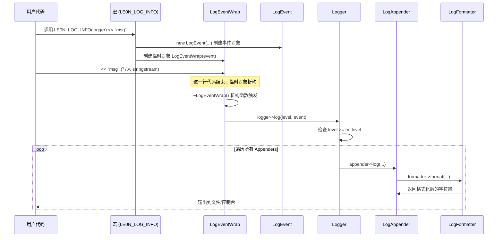

# C++ 高性能日志系统源码分析指南

本文档旨在帮助开发者（特别是 C++ 初学者）快速理解本项目的日志系统架构、设计意图及核心代码实现。

## 1. 项目概览

这是一个轻量级、可扩展的 C++ 日志库，模仿了 Log4j 的设计思想。
*   **核心功能**：支持多级别日志控制、流式日志输入、自定义日志格式、多种输出地（控制台、文件）。
*   **技术栈**：C++11 标准（大量使用智能指针、RAII 机制）。

## 2. 快速开始 (How to Build)

本项目使用 CMake 构建。

### 编译步骤
```bash
# 1. 在项目根目录下创建一个 build 目录
mkdir build && cd build

# 2. 生成 Makefile
cmake ..

# 3. 编译
make

# 4. 运行测试程序
../bin/le0n_test
```

### 简单使用示例

以下代码展示了如何创建一个日志器，并同时配置控制台输出和文件输出。

```cpp
// 引入头文件
#include "../le0n/log.h"
#include <iostream>

int main(int argc, char** argv) {
    // 1. 创建日志器 (Logger)
    le0n::Logger::ptr logger(new le0n::Logger);
    
    // 2. 添加控制台输出 (StdoutLogAppender)
    // 默认格式，输出到标准输出
    logger->addAppender(le0n::LogAppender::ptr(new le0n::StdoutLogAppender));

    // 3. 添加文件输出 (FileLogAppender)
    le0n::FileLogAppender::ptr file_appender(new le0n::FileLogAppender("./log.txt"));
    
    // 4. 自定义日志格式 (LogFormatter)
    // 格式含义：时间 线程ID 线程名 协程ID [级别] [日志名称] 文件名:行号 消息 换行
    le0n::LogFormatter::ptr fmt(new le0n::LogFormatter("%d{%Y-%m-%d %H:%M:%S}%T%t%T%N%T%F%T[%p]%T[%c]%T%f:%l%T%m%n"));
    file_appender->setFormatter(fmt);
    
    // 5. 设置文件输出的日志级别
    // 只有 ERROR 及以上级别的日志才会写入文件
    file_appender->setLevel(le0n::LogLevel::ERROR);

    logger->addAppender(file_appender);
    
    // 6. 开始打印日志
    std::cout << "hello le0n log" << std::endl; // 标准 cout 测试
    
    // 使用流式宏 (Stream Macro)
    LE0N_LOG_INFO(logger) << "test macro";       // 输出到控制台
    LE0N_LOG_ERROR(logger) << "test macro error"; // 输出到控制台 和 文件

    // 使用格式化宏 (Format Macro)
    LE0N_LOG_FMT_ERROR(logger, "test fmt error %s", "hello");

    // 7. 使用单例管理器获取日志器
    auto l = le0n::LoggerMgr::GetInstance()->getLogger("xx");
    LE0N_LOG_INFO(l) << "xxx";

    return 0;
}
```

---

## 3. 系统架构 (Architecture)

### 核心模块关系图 (Class Diagram)

整个系统由以下几个核心类组成，它们共同协作完成日志的收集、格式化和输出。


#### 类图解析
*   **组合关系 (Composition/Aggregation)**:
    *   `Logger "1" o-- "*" LogAppender`: 一个 Logger 对象内部维护了一个 Appender 列表。这意味着你可以给同一个 Logger 添加多个 Appender，实现“一次打印，多处输出”（例如同时写文件和打印屏幕）。
    *   `LogAppender "1" o-- "1" LogFormatter`: 每个 Appender 都有自己独立的 Formatter。这意味着你可以让控制台输出简单的格式，而文件日志输出包含详细时间戳的复杂格式。
*   **继承关系 (Inheritance)**:
    *   `LogAppender` 是一个抽象基类（定义了接口），`StdoutLogAppender`（控制台）和 `FileLogAppender`（文件）是它的具体实现类。这体现了多态性，方便未来扩展其他类型的输出地（如网络日志）。
*   **依赖关系 (Dependency)**:
    *   `Logger`, `LogAppender`, `LogFormatter` 都依赖于 `LogEvent`。`LogEvent` 是数据载体，在各个模块间传递。

#### **模块职责与关系深度解析**

整个日志系统可以划分为 **管理层、核心层、输出层** 和 **数据层**，它们通过巧妙的组合与依赖关系协同工作。

1. **管理层 (LoggerManager)**
   - **职责**：整个系统的入口，采用**单例模式**。它维护了一个 Map 容器来管理所有的 Logger 对象。
   - **关系**：LoggerManager 聚合（Aggregation）了多个 Logger。默认提供一个 root Logger，确保系统一启动即可用。
2. **核心层 (Logger)**
   - **职责**：日志系统的枢纽。它负责接收日志请求，进行级别判断（Filter），然后将合法的日志分发给内部持有的所有 LogAppender。
   - **关系**：Logger 内部维护了一个 LogAppender 列表（一对多关系），实现了一条日志既打印到控制台又写入文件的功能。
3. **数据与 RAII 层 (LogEventWrap & LogEvent)**
   - **LogEvent (数据包)**：这是一个纯粹的数据载体，封装了日志产生时的所有上下文（时间戳、线程ID、文件名、行号）以及用户写入的消息内容（m_ss stringstream）。
   - **LogEventWrap (触发器)**：**这是实现流式日志的关键类。**
     - 当用户使用宏 LE0N_LOG_INFO(logger) << "msg" 时，实际上是创建了一个临时的 LogEventWrap 对象。
     - **RAII 机制**：该对象内部持有一个 LogEvent。当这一行代码执行完毕，LogEventWrap 析构，其**析构函数**会自动调用 logger->log(event)，从而完成日志的自动提交。
4. **输出与格式化层 (Appender & Formatter)**
   - **LogAppender**：抽象基类，定义了“日志去哪儿”。子类 FileLogAppender 和 StdoutLogAppender 实现了具体的写入逻辑。
   - **LogFormatter**：负责“日志长什么样”。它将模式字符串（如 %d{%Y-%m-%d} %m%n）解析为一系列 FormatItem，最终将 LogEvent 中的数据拼装成字符串。每个 LogAppender 都有自己独立的 LogFormatter，这意味着控制台和文件可以有完全不同的日志格式。

### 核心对象关系图

1. LoggerManager (大管家) ：手里拿着一个账本 ( m_loggers )，管理着全系统所有的 Logger（比如 system logger, business logger, root logger）。
2. Logger (分队长) ：每个 Logger 负责一类日志，它手里拿着一份名单 ( m_appenders )，管理着多个输出目的地（比如同时输出到控制台和文件）。
3. LogAppender (执行者) ：真正的干活人，负责把日志写到具体的地方（屏幕、磁盘等）。

~~~mermaid
classDiagram
    LoggerManager "1" *-- "*" Logger : manages
    Logger "1" o-- "*" LogAppender : contains
    
    class LoggerManager {
        -map~string, Logger~ m_loggers
        +getLogger(name)
    }

    class Logger {
        -string m_name
        -list~LogAppender~ m_appenders
        -LogFormatter m_formatter
        +log(level, event)
        +addAppender(appender)
    }

    class LogAppender {
        <<Abstract>>
        -LogFormatter m_formatter
        +log(level, event)*
    }

    class StdoutLogAppender {
        +log()
    }

    class FileLogAppender {
        -string m_filename
        +log()
    }

    LogAppender <|-- StdoutLogAppender
    LogAppender <|-- FileLogAppender

~~~


## 4. 核心流程与关键机制

### 4.1 日志流转过程 (Sequence Diagram)

当你调用 `LE0N_LOG_INFO(logger) << "hello";` 时，系统内部发生了什么？



#### 流程解析
1.  **宏展开与对象创建**: 用户调用宏时，首先创建一个 `LogEvent` 对象（包含时间、行号等），然后将其包装进一个 `LogEventWrap` **临时对象**。
2.  **流式写入**: 用户紧接着使用的 `<< "msg"` 操作符，实际上是将数据写入了 `LogEventWrap` 持有的 `LogEvent` 内部的 `stringstream` 中。
3.  **RAII 自动提交**: 当这一行代码执行结束（遇到分号），`LogEventWrap` 临时对象生命周期结束，自动调用析构函数 `~LogEventWrap()`。
4.  **日志分发**: 在析构函数中，系统自动调用 `logger->log()` 方法，将携带了完整消息的 Event 提交给 Logger。
5.  **格式化与输出**: Logger 遍历其内部所有的 Appender，每个 Appender 调用自己的 Formatter 将 Event 转换成字符串，最后写入文件或控制台。

### 4.2 关键 C++ 特性解析

#### 1. RAII 与 临时对象析构 (The "Destructor Magic")
这是本项目最精彩的设计之一。
*   **问题**：如何实现类似 `std::cout` 的流式调用？
*   **方案**：
    1.  宏 `LE0N_LOG_INFO` 创建一个 `LogEventWrap` 的**临时对象**。
